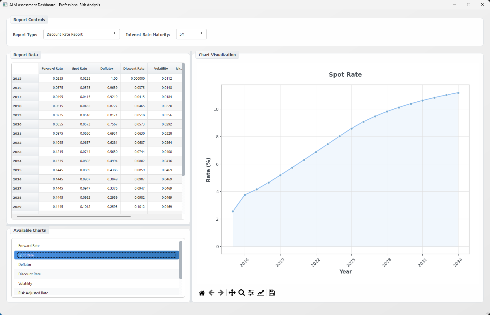
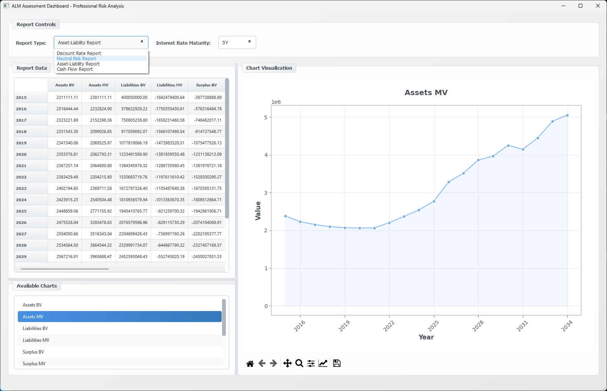

# ALM Assessment Dashboard

**Professional Asset and Liability Management Platform in Python**

A comprehensive, enterprise-grade Asset and Liability Management (ALM) toolkit designed for insurance companies and financial institutions. This Python-based platform provides sophisticated functionality for projecting contract cash flows, valuing assets and liabilities, and generating critical ALM reports with advanced risk analysis capabilities.

## 📸 Application Screenshots

<div align="center">
  <table>
    <tr>
      <td align="center">
        
        <br/>
        <em>Main Dashboard Interface</em>
      </td>
      <td align="center">
        
        <br/>
        <em>Advanced Report Analysis</em>
      </td>
    </tr>
  </table>
</div>

---

## 🚀 Key Features

### 🏢 Enterprise-Grade ALM Framework
* **Realistic Industry Parameters**: Pre-configured with standard insurance industry defaults (10,000 contracts, realistic premiums, fees, tax rates, asset allocations)
* **Comprehensive Data Integration**: 10-year historical market data (2015-2024) including forward rates, liquidity premiums, mortality tables, and repurchase rates
* **Advanced Risk Analytics**: Volatility-based risk adjustments, neutral risk factor calculations, and stress testing capabilities
* **Interactive Scenario Analysis**: Choose from 1Y to 30Y interest rate maturities for comprehensive scenario modeling
* **Professional Reporting Suite**: Four comprehensive report types with enhanced calculations and validation frameworks

### 🎨 Modern User Interface
* **Professional Design**: Gradient theme with neutral color palette and responsive layout
* **Interactive Controls**: Real-time maturity selection with automatic report regeneration
* **Advanced Visualization**: Multi-series charts with professional styling, transparency effects, and intelligent axis formatting
* **Responsive Tables**: Auto-adjusting column widths, header text wrapping, and intelligent numeric formatting
* **Seamless Navigation**: Independent chart selection without table interference, professional matplotlib integration

### 📊 Comprehensive Analytics
* **10-Year Historical Analysis**: Monthly data from 2015-2024 across multiple maturities with volatility metrics
* **Multiple Maturity Support**: 1Y, 2Y, 3Y, 4Y, 5Y, 7Y, 10Y, 15Y, 20Y, and 30Y scenarios
* **Enhanced Methodologies**: Bootstrapping for discount rates, neutral risk validation, asset-liability matching
* **Risk Management**: Comprehensive stress testing, duration gap analysis, and coverage ratio monitoring

---

## 📋 Installation

### Prerequisites
- **Python 3.8+** (Recommended: Python 3.9 or higher)
- **Operating System**: Windows 10/11, macOS 10.14+, or Linux (Ubuntu 18.04+)
- **Memory**: Minimum 4GB RAM (8GB recommended for large datasets)

### Quick Setup

1. **Clone the Repository**
   ```bash
   git clone https://github.com/yourusername/ALM.git
   cd ALM
   ```

2. **Create Virtual Environment** (Recommended)
   ```bash
   # Windows
   python -m venv venv
   venv\Scripts\activate

   # macOS/Linux
   python3 -m venv venv
   source venv/bin/activate
   ```

3. **Install Dependencies**
   ```bash
   pip install -r requirements.txt
   ```

### Dependencies
```text
numpy>=1.21.0          # Numerical computing and array operations
pandas>=1.3.0          # Data manipulation and analysis
PyQt5>=5.15.0          # GUI framework for desktop application
matplotlib>=3.4.0      # Advanced plotting and visualization
scipy>=1.7.0           # Scientific computing (optional, for advanced analytics)
```

---

## 🖥️ Usage

### GUI Application

Launch the professional ALM dashboard:

```bash
python main_GUI.py
```

#### Interface Overview
* **Report Selection**: Choose from four comprehensive report types
* **Maturity Selection**: Select interest rate maturity (1Y-30Y) for scenario analysis
* **Data Visualization**: Professional charts with multi-series support and interactive navigation
* **Parameter Configuration**: Access advanced parameter dialog for model customization
* **Real-time Updates**: Automatic report regeneration when parameters change

### Report Types

#### 1. 📈 Discount Rate Report
**Advanced interest rate analysis with bootstrapping methodology**
- Forward rates across all maturities with historical trends
- Spot rate derivation using proper bootstrapping techniques
- Deflator calculations with accurate discount factor computation
- Risk-adjusted rates incorporating volatility premiums
- Comprehensive output: Forward Rate, Spot Rate, Deflator, Discount Rate, Volatility, Risk Adjusted Rate, Risk Premium

#### 2. ⚖️ Neutral Risk Report
**Enhanced bond valuation with comprehensive validation**
- Improved present value calculations with market value validation
- Bond cash flow modeling (annual coupons + principal repayment)
- Neutral factor calculation using market value equivalence methodology
- Validation framework with tolerance checks and error reporting
- Extended output: Bond CF, PV of CF, Neutral Factor, Neutral CF, Cumulative PV

#### 3. 🏦 Asset-Liability Report
**Comprehensive matching analysis and risk assessment**
- Book value and market value analysis across all asset classes
- Duration analysis with asset and liability duration calculations
- Gap analysis for duration mismatch identification
- Surplus monitoring with real-time surplus/deficit tracking
- Yield spread analysis comparing asset yields vs liability costs
- Coverage ratios for comprehensive risk assessment

#### 4. 💰 Cash Flow Report
**Detailed cash flow projections and sustainability analysis**
- Premium income, investment income, benefit payments, and expense projections
- Operating vs investment cash flow separation
- Coverage analysis with sustainability metrics
- Cumulative tracking with running totals and break-even analysis
- Risk metrics including cash flow volatility and stress testing

### Programmatic Usage

```python
from ALM import ALM
import pandas as pd

# Initialize ALM model with realistic industry defaults
model = ALM()

# Load comprehensive 10-year market data
data_files = {
    'forward_rates': 'input/fwd_rates.csv',
    'liquidity_premium': 'input/liquidity_premium.csv',
    'mortality_table': 'input/mortality_table.csv',
    'repurchase_rates': 'input/repurchase_rates.csv'
}

# Load all data files with error handling
for data_type, file_path in data_files.items():
    success = model.load_data_from_file(file_path, data_type)
    if not success:
        print(f"Failed to load {data_type}")

# Generate comprehensive analysis across multiple maturities
maturities = ['5Y', '10Y', '20Y', '30Y']
for maturity in maturities:
    print(f"\n=== {maturity} Scenario Analysis ===")
    
    # Generate discount rate report
    discount_df = model.report_discount_rate(maturity)
    print(f"Average Forward Rate: {discount_df['Forward_Rate'].mean():.4f}")
    print(f"Risk Premium: {discount_df['Risk_Adjusted_Rate'].mean() - discount_df['Forward_Rate'].mean():.4f}")
    
    # Generate neutral risk analysis
    neutral_df = model.report_neutral_risk()
    print(f"Neutral Factor: {model.neutral_factor_value:.6f}")

# Generate comprehensive reports
asset_liability_df = model.report_asset_liability()
cash_flow_df = model.report_cash_flow()

print("\n=== Portfolio Summary ===")
print(f"Total Assets (Market Value): ${model.total_assets_market_value():,.0f}")
print(f"Total Liabilities (Market Value): ${model.total_liabilities_vm():,.0f}")
print(f"Surplus: ${model.total_assets_market_value() - model.total_liabilities_vm():,.0f}")
```

---

## 📁 Project Structure

```text
ALM-Assessment-Dashboard/
├── 📁 ALM/                          # Core ALM engine
│   ├── __init__.py                  # Package initialization
│   └── ALM.py                       # Enhanced ALM model (1000+ lines)
├── 📁 tools/                        # Utility modules
│   ├── __init__.py                  # Tools package initialization
│   └── df_to_qtable.py             # DataFrame to QTable conversion utilities
├── 📁 input/                        # Comprehensive market data (2015-2024)
│   ├── fwd_rates.csv               # Forward rates + volatility (1Y-30Y maturities)
│   ├── liquidity_premium.csv       # Liquidity premiums + volatility
│   ├── mortality_table.csv         # Comprehensive mortality table
│   └── repurchase_rates.csv        # Repurchase rates + volatility
├── 📄 main_GUI.py                   # Enhanced PyQt5 application (400+ lines)
├── 📄 dialog_parameters.py          # Parameter configuration dialog
├── 📄 main_window.ui               # Professional UI design with gradient theme
├── 📄 dialog_window.ui             # Parameter dialog layout
├── 📄 requirements.txt             # Python dependencies
├── 📄 LICENSE                      # MIT License
└── 📄 README.md                    # Comprehensive documentation
```

---

## 📊 Enhanced Data Architecture

### Forward Rates Dataset (`fwd_rates.csv`)
```text
📅 Time Period: 2015-2024 (120 monthly observations)
📈 Maturities: 1Y, 2Y, 3Y, 4Y, 5Y, 7Y, 10Y, 15Y, 20Y, 30Y
📊 Volatility Data: Corresponding volatility columns for each maturity
🔢 Format: Date-indexed CSV with numeric rate and volatility data
📋 Usage: Discount rate calculations, scenario analysis, risk modeling
```

### Liquidity Premium Dataset (`liquidity_premium.csv`)
```text
📅 Time Period: 2015-2024 (monthly data)
💰 Content: Liquidity premium adjustments and volatility metrics
🎯 Usage: Risk premium calculations, spread analysis, credit adjustments
```

### Mortality Table (`mortality_table.csv`)
```text
👥 Content: Age-based mortality rates (Qx) and survival probabilities (Px)
📊 Range: Comprehensive age coverage for life insurance calculations
🎯 Usage: Life insurance liability calculations, longevity risk assessment
```

### Repurchase Rates (`repurchase_rates.csv`)
```text
📅 Time Period: 2015-2024 (monthly data)
💼 Content: Policy repurchase rates and volatility
🎯 Usage: Surrender rate modeling, cash flow projections, lapse risk analysis
```

---

## 🎨 Advanced GUI Features

### Professional Interface Design
* **Modern Gradient Theme**: Neutral professional color scheme with enhanced visual hierarchy
* **Responsive Layout**: Auto-adjusting panels with intelligent splitter controls
* **Enhanced Typography**: Optimized fonts, spacing, and contrast for extended use
* **Accessibility**: High contrast ratios and keyboard navigation support

### Interactive Visualization Engine
* **Multi-Series Charts**: Simultaneous plotting of multiple data series with legend management
* **Professional Styling**: Lighter colors, optimized line thickness, enhanced transparency
* **Interactive Navigation**: Full matplotlib toolbar with zoom, pan, save, and configuration options
* **Intelligent Y-Axis**: Automatic unit detection (Rate %, Factor, Cash Flow $, Value) with appropriate scaling

### Enhanced Data Tables
* **Smart Formatting**: Underscores replaced with spaces, intelligent numeric precision
* **Optimized Layout**: Reduced column widths with auto-sizing and text wrapping
* **Professional Styling**: Alternating row colors, hover effects, selection highlighting
* **Independent Selection**: Chart selection operates independently of table row selection

---

## 🏗️ Enhanced ALM Model Architecture

### Realistic Industry Parameters
```python
# Insurance Portfolio Configuration (Industry Standards)
insured_number = 10000              # Realistic portfolio size
insured_premium = 50000             # Annual premium per contract ($)
average_age = 45                    # Typical insurance policyholder age
contracts_maturity = 20             # Long-term insurance contracts (years)

# Fee Structure (Industry-Standard Rates)
charges_rate = 0.015                # 1.5% proportional charge
fee_pct_premium = 0.025             # 2.5% of premium fee
tax_rate = 0.22                     # 22% corporate tax rate

# Asset Allocation (Conservative Insurance Portfolio)
alloc_bonds = 0.60                  # 60% bonds (stability focus)
alloc_stocks = 0.30                 # 30% stocks (growth component)
alloc_cash = 0.10                   # 10% cash (liquidity buffer)
```

### Complete ALM Function Implementation

#### 🏦 Asset Management (Fully Implemented)
* **`assets_variables_projection()`**: Multi-asset portfolio projections with bonds, stocks, and cash
* **`total_assets_booked_value()`**: Aggregate book value calculations across all asset classes
* **`total_assets_market_value()`**: Market value aggregation with interest rate sensitivity
* **`variation_pmvl_reference()`**: Portfolio market value variations and comprehensive stress testing

#### 📋 Liability Management (Fully Implemented)
* **`cash_flows_liabilities()`**: Comprehensive liability cash flow modeling with mortality and surrender rates
* **`calculation_BEL()`**: Best Estimate Liability calculations with risk margins and regulatory compliance
* **`total_liabilities_vnc()`** / **`total_liabilities_vm()`**: Complete liability aggregation (book and market value)

#### 📊 Advanced Analytics (Fully Implemented)
* **`local_gaap_pnl()`**: Complete local GAAP P&L generation with all income statement components
* **`value_in_force()`**: Value in Force calculations with risk-adjusted discount rates
* **`total_value_options_garantees()`**: Comprehensive options and guarantees valuation (GMDB, GMWB, GMAB)

#### 📈 Enhanced Reporting (Fully Implemented)
* **`report_discount_rate()`**: Enhanced discount rate analysis with bootstrapping methodology
* **`report_neutral_risk()`**: Improved neutral risk calculations with comprehensive validation
* **`report_asset_liability()`**: Complete asset-liability matching analysis with gap analysis
* **`report_cash_flow()`**: Comprehensive cash flow projections with sustainability metrics

---

## 🔧 API Reference

### Core ALM Class

#### Data Loading Methods
```python
load_data_from_file(file_path: str, data_type: str) -> bool
```
Load CSV data with automatic date parsing, numeric conversion, and validation.

**Parameters:**
- `file_path`: Path to CSV file
- `data_type`: Type of data ('forward_rates', 'liquidity_premium', 'mortality_table', 'repurchase_rates')

**Returns:** Boolean indicating success/failure

#### Report Generation Methods
```python
report_discount_rate(selected_maturity: str = '5Y') -> pd.DataFrame
```
Generate comprehensive discount rate analysis for specified maturity.

```python
report_neutral_risk() -> pd.DataFrame
```
Generate enhanced neutral risk analysis with validation framework.

```python
report_asset_liability() -> pd.DataFrame
```
Generate complete asset-liability matching analysis.

```python
report_cash_flow() -> pd.DataFrame
```
Generate detailed cash flow projections and analysis.

#### Utility Methods
```python
afficher_data(attr_name: str) -> None
```
Display loaded data attributes for debugging and validation.

```python
set_default() -> None
```
Reset all parameters to class-level defaults.

---

## 📈 Example Workflows

### Comprehensive Risk Analysis
```python
from ALM import ALM
import matplotlib.pyplot as plt

# Initialize ALM model
alm = ALM()

# Load all market data
data_files = {
    'forward_rates': 'input/fwd_rates.csv',
    'liquidity_premium': 'input/liquidity_premium.csv', 
    'mortality_table': 'input/mortality_table.csv',
    'repurchase_rates': 'input/repurchase_rates.csv'
}

for data_type, file_path in data_files.items():
    alm.load_data_from_file(file_path, data_type)

# Multi-maturity scenario analysis
maturities = ['1Y', '5Y', '10Y', '20Y', '30Y']
results = {}

for maturity in maturities:
    print(f"\n=== {maturity} Scenario Analysis ===")
    
    # Generate discount rate analysis
    discount_df = alm.report_discount_rate(maturity)
    
    # Calculate key metrics
    avg_forward = discount_df['Forward_Rate'].mean()
    avg_risk_adj = discount_df['Risk_Adjusted_Rate'].mean()
    risk_premium = avg_risk_adj - avg_forward
    
    results[maturity] = {
        'forward_rate': avg_forward,
        'risk_premium': risk_premium,
        'volatility': discount_df['Volatility'].mean()
    }
    
    print(f"Average Forward Rate: {avg_forward:.4f}")
    print(f"Risk Premium: {risk_premium:.4f}")
    print(f"Average Volatility: {discount_df['Volatility'].mean():.4f}")

# Generate comprehensive reports
print("\n=== Comprehensive Analysis ===")
neutral_df = alm.report_neutral_risk()
asset_liability_df = alm.report_asset_liability()
cash_flow_df = alm.report_cash_flow()

print(f"Neutral Factor: {alm.neutral_factor_value:.6f}")
print(f"Market Value Validation: ${alm.pv_neutral_check:,.0f}")
```

### Custom Parameter Analysis
```python
# Create custom scenarios
scenarios = {
    'Conservative': {'alloc_bonds': 0.80, 'alloc_stocks': 0.15, 'alloc_cash': 0.05},
    'Balanced': {'alloc_bonds': 0.60, 'alloc_stocks': 0.30, 'alloc_cash': 0.10},
    'Growth': {'alloc_bonds': 0.40, 'alloc_stocks': 0.50, 'alloc_cash': 0.10}
}

for scenario_name, params in scenarios.items():
    print(f"\n=== {scenario_name} Scenario ===")
    
    # Apply scenario parameters
    for param, value in params.items():
        setattr(alm, param, value)
    
    # Generate analysis
    asset_liability_df = alm.report_asset_liability()
    cash_flow_df = alm.report_cash_flow()
    
    # Calculate key metrics
    total_assets = alm.total_assets_market_value()
    total_liabilities = alm.total_liabilities_vm()
    surplus = total_assets - total_liabilities
    
    print(f"Total Assets: ${total_assets:,.0f}")
    print(f"Total Liabilities: ${total_liabilities:,.0f}")
    print(f"Surplus: ${surplus:,.0f}")
    print(f"Surplus Ratio: {surplus/total_assets:.2%}")
```

---

## ⚡ Performance Optimization

### Data Processing
* **Vectorized Operations**: NumPy-based calculations for efficient computation
* **Optimized Pandas**: Efficient DataFrame operations with minimal memory copying
* **Caching Strategy**: Intelligent caching of calculated deflators and intermediate results

### GUI Responsiveness
* **Asynchronous Updates**: Non-blocking report generation for large datasets
* **Progressive Loading**: Incremental data loading for improved startup time
* **Memory Management**: Efficient matplotlib figure management and cleanup

### Scalability Considerations
* **Large Portfolios**: Optimized for portfolios up to 100,000+ contracts
* **Extended Projections**: Support for projection periods up to 50 years
* **Multiple Scenarios**: Efficient batch processing for scenario analysis

---

## 🐛 Troubleshooting

### Common Issues and Solutions

#### Data Loading Problems
```python
# Issue: CSV file format errors
# Solution: Ensure proper date formatting and numeric columns
df = pd.read_csv('input/fwd_rates.csv', parse_dates=['Date'])
print(df.dtypes)  # Verify data types
```

#### Calculation Warnings
```python
# Issue: Neutral risk validation warnings
# Solution: Check data consistency and market value alignment
alm.afficher_data('forward_rates')  # Display loaded data
print(f"Market Value: {alm.bonds_initial_mv}")
print(f"PV Check: {alm.pv_neutral_check}")
```

#### GUI Performance Issues
```python
# Issue: Slow chart rendering
# Solution: Reduce data points or optimize matplotlib settings
plt.rcParams['figure.max_open_warning'] = 0  # Disable warnings
plt.ioff()  # Turn off interactive mode for batch processing
```

### Debug Mode
```python
# Enable comprehensive debugging
alm = ALM()
alm.afficher_data('forward_rates')    # Display forward rates
alm.afficher_data('deflator')         # Display calculated deflators
alm.afficher_data('mortality_table')  # Display mortality data

# Validate calculations
discount_df = alm.report_discount_rate('10Y')
print("Discount Rate Validation:")
print(discount_df.describe())
```

---

## 🤝 Contributing

We welcome contributions from the financial technology and actuarial communities!

### Development Guidelines
1. **Code Standards**: Follow PEP8 style conventions with comprehensive docstrings
2. **Testing**: Include unit tests for new functionality using pytest framework
3. **Documentation**: Update README.md and inline documentation for significant changes
4. **Performance**: Ensure new features maintain application responsiveness

### Contribution Process
1. Fork the repository and create a feature branch
2. Implement changes with comprehensive testing
3. Update documentation and examples
4. Submit a Pull Request with detailed description

```bash
git checkout -b feature/enhanced-risk-analytics
git commit -m "Add advanced stress testing capabilities"
git push origin feature/enhanced-risk-analytics
```

---

## 📄 License

This project is licensed under the **MIT License** - see [LICENSE](LICENSE) for details.

### Commercial Use
This software is suitable for commercial use in insurance companies, financial institutions, and consulting firms. The MIT license allows for modification and redistribution while maintaining attribution.

---

## 📚 Changelog

### Version 2.0 (Current) - Professional Enterprise Release
* ✅ **Enhanced Data Architecture**: 10-year historical data (2015-2024) with comprehensive volatility analysis
* ✅ **Modern UI/UX**: Professional gradient theme with responsive design and enhanced user experience
* ✅ **Interactive Controls**: Real-time maturity selection with automatic report regeneration
* ✅ **Advanced Calculations**: Enhanced discount rate methodology with bootstrapping and comprehensive neutral risk validation
* ✅ **Complete ALM Implementation**: All ALM functions fully implemented (assets, liabilities, P&L, VIF, options & guarantees)
* ✅ **Professional Visualization**: Multi-series charts with advanced styling and reduced interference
* ✅ **Optimized Performance**: Better table formatting, column management, and header text wrapping
* ✅ **Comprehensive Reporting**: Four complete report types with detailed analytics and validation frameworks

### Version 1.0 (Legacy) - Basic Framework
* ✅ Basic ALM framework with simple calculations
* ✅ Basic GUI with limited styling
* ✅ Single-year data support
* ✅ Basic visualization capabilities

---

## 🎯 Roadmap

### Version 2.1 (Planned)
* 🔄 **Real-time Data Integration**: API connections to market data providers
* 🔄 **Advanced Stress Testing**: Monte Carlo simulations and scenario generation
* 🔄 **Regulatory Reporting**: Solvency II and IFRS 17 compliance modules
* 🔄 **Cloud Deployment**: Docker containerization and cloud platform support

### Version 3.0 (Future)
* 🔄 **Machine Learning Integration**: Predictive analytics for mortality and lapse rates
* 🔄 **Multi-Currency Support**: International portfolio management capabilities
* 🔄 **Advanced Optimization**: Portfolio optimization and asset allocation algorithms
* 🔄 **Enterprise Features**: Multi-user support, audit trails, and workflow management

---

## 📞 Support

For technical support, feature requests, or collaboration opportunities:

* **Documentation**: Comprehensive inline documentation and examples
* **Issues**: GitHub Issues for bug reports and feature requests
* **Community**: Join our discussions for best practices and use cases

---

**Built with ❤️ for the Insurance and Financial Services Industry**

*Empowering actuaries, risk managers, and financial analysts with professional-grade ALM tools.*
